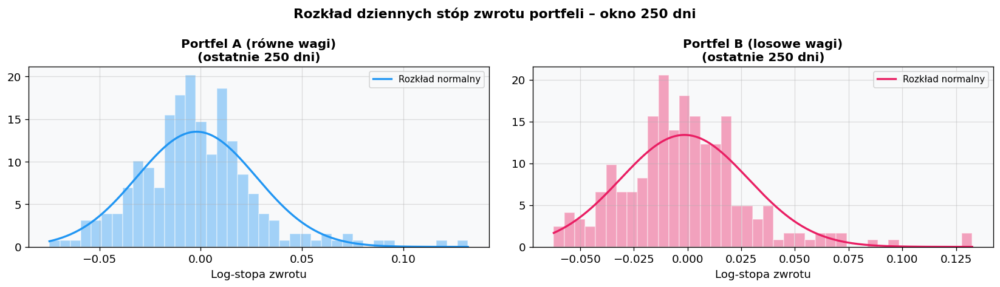
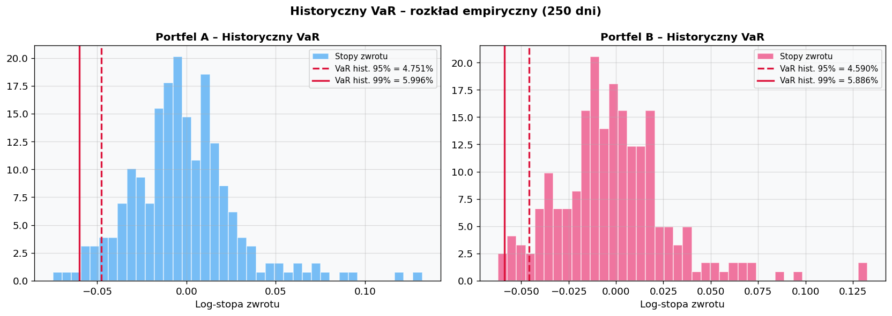
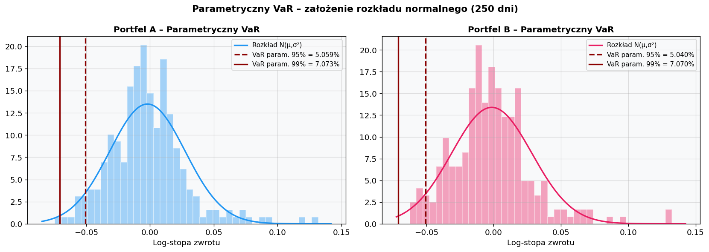
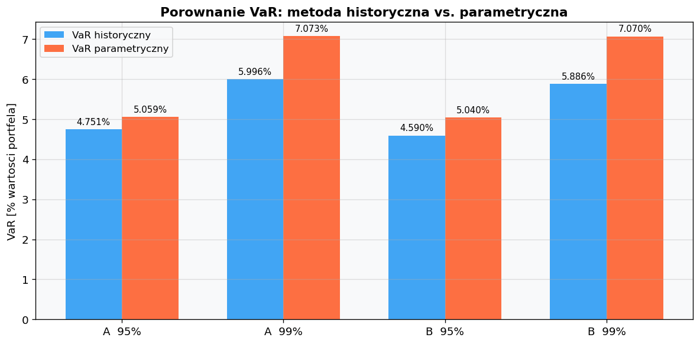

# Raport: Value at Risk – metody historyczna i parametryczna

**Autor:** Oleksandra Krykun  
**Data:** 21 kwietnia 2026  
**Kurs:** Market Risk Lab – Zadanie Domowe 2

---

## Cel

Obliczenie VaR dwoma metodami (historyczną i parametryczną) dla dwóch portfeli złożonych z akcji wybranych w Zadaniu 1, przy poziomach ufności 95% i 99%, oraz porównanie wyników.

---

## 1. Definicja portfeli

Zdefiniowano dwa portfele złożone z tych samych 5 spółek sektora finansowego Stanów Zjednoczonych (GS, C, AIG, BAC, MS), różniące się wyłącznie strukturą wag:

- **Portfel A – równe wagi:** każda spółka ma wagę 20%. Klasyczny benchmark dywersyfikacji nieważonej.
- **Portfel B – losowe wagi:** wagi wylosowane przez normalizację wartości bezwzględnych z $\mathcal{N}(0,1)$, co gwarantuje wagi dodatnie sumujące się do 1 (`seed=7` dla powtarzalności).

| Ticker | Spółka | Portfel A | Portfel B |
|--------|--------|-----------|-----------|
| GS | Goldman Sachs | 20,00% | 30,89% |
| C | Citigroup | 20,00% | 8,73% |
| AIG | AIG | 20,00% | 6,67% |
| BAC | Bank of America | 20,00% | 20,77% |
| MS | Morgan Stanley | 20,00% | 32,94% |
| **SUMA** | | **100,00%** | **100,00%** |

Dzienne stopy zwrotu portfeli obliczono jako ważoną sumę log-stóp zwrotu poszczególnych akcji: $r_t^{P} = \sum_i w_i \cdot r_{t,i}$.

---

## 2. Okno 250 dni roboczych

VaR wyznaczono na podstawie **ostatnich 250 dni roboczych** z pełnego okresu próby:

- Okno: **03-08-2007 – 30-07-2008**
- Liczba obserwacji: **250**

Jest to standardowe minimum wymagane przez regulacje Basel II/III dla modeli wewnętrznych banków. Okno to obejmuje fazę narastającego kryzysu finansowego – od sygnału BNP Paribas (09.08.2007, zamrożenie wypłat z trzech funduszy hedgingowych o uzasadnieniu „complete evaporation of liquidity" na rynku instrumentów opartych na kredytach subprime) do końca analizowanego okresu.

Na histogramach widoczna jest dodatnia skośność obu portfeli - ujemnych stóp zwrotu jest więcej niż dodatnich, jednak sporadyczne duże odbicia rynkowe (marzec 2008 po uratowaniu Bear Stearns, lipiec 2008) tworzą długi prawy ogon, który podciąga średnią powyżej mediany. Lewy ogon empiryczny jest węższy od gaussowskiego - model normalny przeszacowuje prawdopodobieństwo dużych strat -— natomiast prawy ogon jest grubszy, co oznacza, że duże dodatnie zwroty zdarzają się częściej niż przewiduje rozkład normalny.

---

## 3. Historyczny VaR

VaR historyczny = ujemny kwantyl empiryczny stóp zwrotu, bez żadnych założeń parametrycznych:

$$\text{VaR}_{\alpha}^{\text{hist}} = -Q_{1-\alpha}(r_1, \ldots, r_{250})$$

Przy 95%: 13-ty najgorszy wynik z 250 obserwacji. Przy 99%: trzeci najgorszy wynik z 250.

| Portfel | VaR hist. 95% | VaR hist. 99% |
|---------|--------------|--------------|
| Portfel A | **4,7511%** | **5,9958%** |
| Portfel B | **4,5904%** | **5,8858%** |

---

## 4. Parametryczny VaR

Zakładamy, że stopy zwrotu portfela mają rozkład normalny $\mathcal{N}(\mu, \sigma^2)$.  
VaR wyznaczamy analitycznie ze wzoru:

$$\text{VaR}_{\alpha}^{\text{param}} = -(\mu - z_{\alpha} \cdot \sigma)$$

gdzie $z_{\alpha}$ to kwantyl standardowego rozkładu normalnego:
- dla $\alpha = 95\%$: $z_{0.05} \approx 1{,}645$
- dla $\alpha = 99\%$: $z_{0.01} \approx 2{,}326$

$\mu$ i $\sigma$ estymujemy z 250-dniowego okna historycznego.

---

## 5. Porównanie wyników

| Portfel | Poziom ufności | VaR historyczny | VaR parametryczny | Różnica (param − hist) |
|---------|---------------|----------------|------------------|----------------------|
| Portfel A | 95% | 4,7511% | 5,0594% | +0,3082% |
| Portfel A | 99% | 5,9958% | 7,0725% | +1,0767% |
| Portfel B | 95% | 4,5904% | 5,0400% | +0,4495% |
| Portfel B | 99% | 5,8858% | 7,0698% | +1,1840% |

Statystyki opisowe portfeli w oknie 250 dni:

| Miara | Portfel A | Portfel B |
|-------|-----------|-----------|
| Średnia dzienna | −0,2004% | −0,1409% |
| Odch. std. dzienna | 2,9540% | 2,9784% |
| Skośność | 0,9266 | 1,0200 |
| Kurtoza (excess) | 2,8097 | 2,9424 |
| Min (najgorszy dzień) | −7,4662% | −6,2229% |

---

## 6. Wnioski

### 6.1 Który portfel jest mniej ryzykowny?

**Portfel B (losowe wagi) jest mniej ryzykowny** według obu metod i obu poziomów ufności.

Wylosowane wagi Portfela B koncentrują się na GS (30,89%) i MS (32,94%) – bankach inwestycyjnych, które w oknie sierpień 2007 – lipiec 2008 radziły sobie relatywnie lepiej – przy jednoczesnej niskiej ekspozycji na AIG (6,67%) i C (8,73%), spółki z największymi stratami w tym okresie. Potwierdza to najgorszy pojedynczy dzień: −6,22% (B) vs −7,47% (A).

> Różnice są jednak **małe** (0,1–0,3 pp przy VaR historycznym), ponieważ wysokie korelacje między spółkami sektora finansowego w warunkach kryzysu ograniczają skuteczność dywersyfikacji wewnątrzsektorowej niezależnie od wag.

---

### 6.2 Która metoda daje wyższy VaR?

**We wszystkich czterech przypadkach VaR parametryczny jest wyższy** niż historyczny, a różnica rośnie wraz z poziomem ufności:

- przy **95%**: różnica ~0,3–0,4 pp
- przy **99%**: różnica ~1,1 pp

Przyczyny:

1. **Dodatnia skośność empirycznego rozkładu stóp zwrotu.** Rzeczywisty rozkład w badanym oknie posiada skośność dodatnią. Model normalny, symetryczny względem średniej, nie uwzględnia tej asymetrii: symetrycznie „rozciąga" oba ogony na podstawie odchylenia standardowego wyznaczonego z całego okna. W efekcie parametryczny lewy ogon jest szerszy niż empiryczny, co bezpośrednio zawyża VaR parametryczny względem historycznego. Metoda historyczna odczytuje kwantyl wprost z danych – krótki gruby lewy ogon daje niższy, bardziej realistyczny poziom straty.

2. **Wpływ kwantyla normalnego przy 99%.** Przy wyższym poziomie ufności stosowany jest kwantyl $z_{0.01} \approx 2{,}326$, znacznie bardziej odległy od centrum rozkładu niż $z_{0.05} \approx 1{,}645$ przy 95%. Im dalej w ogon, tym mocniej założenie normalności zawyża szacunek względem empirii – dlatego rozbieżność między metodami niemal trzykrotnie wzrasta (z ~0,3–0,4 pp do ~1,1 pp) przy przejściu z 95% na 99%.

3. **Stosunkowo spokojny lewy ogon w badanym oknie 250 dni.** Okno sierpień 2007 – lipiec 2008 obejmuje narastający kryzys, ale jeszcze nie jego kulminację (upadek Lehman Brothers, wrzesień 2008). Empiryczne ekstrema z tego okresu są poważne, lecz wciąż nieporównywalne z tym, co model normalny „przewiduje" na poziomie 99% przy wysokim odchyleniu standardowym z całego okna.

---

### 6.3 Wniosek końcowy

W analizowanym oknie kryzysowym **metoda historyczna jest bardziej adekwatna** – oddaje rzeczywisty kształt rozkładu, w tym jego asymetrię. Model parametryczny przeszacowuje ryzyko ogonowe ze względu na założenie symetrii rozkładu normalnego, które w tym oknie nie jest spełnione.

Należy jednak podkreślić, że w innych warunkach rynkowych (silna ujemna skośność, wysoka kurtoza) zależność byłaby odwrotna i to metoda historyczna mogłaby niedoszacowywać ryzyko. Dlatego **obie metody powinny być stosowane równolegle** jako wzajemny sprawdzian.

---
## 6. Wnioski

### Który portfel jest mniej ryzykowny?

**Portfel B (losowe wagi) jest mniej ryzykowny** według VaR historycznego na obu poziomach ufności (4,59% vs 4,75% przy 95%; 5,89% vs 6,00% przy 99%). Wylosowane wagi koncentrują się na GS (30,89%) i MS (32,94%) – bankach inwestycyjnych, które w oknie sierpień 2007 – lipiec 2008 radziły sobie relatywnie lepiej od Citigroup i AIG. Jednocześnie Portfel B ma niższą ekspozycję na AIG (6,67%) i C (8,73%) – spółki z największymi stratami w tym okresie. Potwierdza to niższy najgorszy dzień Portfela B (−6,22% vs −7,47%).

Warto jednak zaznaczyć, że różnice są **małe** (0,1–0,3 pp przy VaR historycznym) ze względu na wysokie korelacje między spółkami sektora finansowego w warunkach kryzysu – dywersyfikacja wewnątrzsektorowa jest ograniczona niezależnie od wag.

#### Metoda historyczna vs. parametryczna – która daje wyższy VaR?

We wszystkich czterech przypadkach **VaR parametryczny jest wyższy** niż historyczny, przy czym różnica rośnie wraz z poziomem ufności (od ~0,3–0,4 pp przy 95% do ~1,1 pp przy 99%).

Przyczyną jest **dodatnia skośność** obu portfeli w analizowanym oknie (0,93 i 1,02). Okno 2007–2008 zawierało nie tylko silne spadki, ale i gwałtowne odbicia rynkowe (marzec 2008 po uratowaniu Bear Stearns, lipiec 2008), które przesuwają empiryczny rozkład w prawo. Model gaussowski zakłada symetrię – przez co jego symetryczny lewy ogon jest grubszy niż faktycznie obserwowany, generując wyższy VaR parametryczny, szczególnie na poziomie 99%.

Kurtoza nadmiarowa obu portfeli (~2,8–2,9) jest wyraźnie wyższa od zera, co wskazuje na grubsze ogony niż rozkład normalny. Efekt ten jest jednak niewystarczający, by VaR historyczny przekroczył parametryczny – dominuje tu opisany wcześniej efekt dodatniej skośności, która przesuwa empiryczny lewy ogon w kierunku centrum względem symetrycznego modelu gaussowskiego.

**Ogólny wniosek:** Dobór metody ma istotne znaczenie. W tym konkretnym oknie kryzysowym model parametryczny **przeszacowuje** ryzyko ogonowe ze względu na asymetrię rozkładu. W innych warunkach (silna ujemna skośność, wysoka kurtoza) zależność byłaby odwrotna. Stanowi to argument za stosowaniem obydwu metod równolegle jako wzajemnego sprawdzianu.

---
*Źródła danych: Yahoo Finance. Teoria: Market Risk Lab – prezentacja „Miary at Risk" (kwiecień 2026).*
