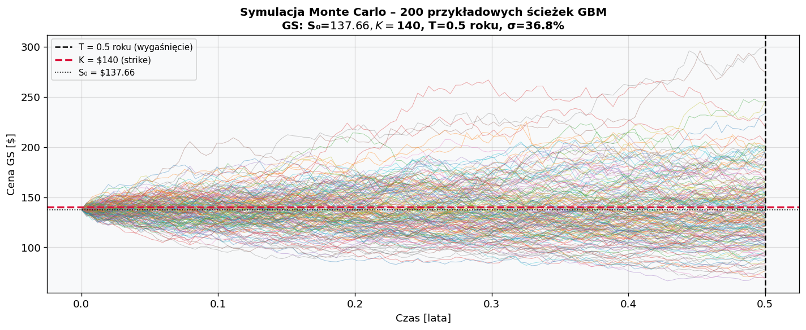

# Raport: Wycena opcji europejskich – Black-Scholes vs Monte Carlo

**Autor:** Oleksandra Krykun  
**Data:** 28 kwietnia 2026  
**Kurs:** Market Risk Lab – Zadanie Domowe 3

---

## Cel

Wycena dwóch europejskich opcji (call i put) na akcje Goldman Sachs (GS) przy użyciu wzoru Blacka-Scholesa oraz metody Monte Carlo (10 000 i 50 000 ścieżek), a następnie porównanie wyników obu metod oraz obliczenie greckich współczynników wrażliwości.

---

## 1. Dane i parametry

**Źródło danych:** Yahoo Finance (`yfinance`), dzienne ceny zamknięcia skorygowane o dywidendy i splity (`Adj Close`).  
**Okres:** 1 sierpnia 2006 – 30 lipca 2008 (503 dni sesyjne).  
**Akcja bazowa:** Goldman Sachs (GS).

| Parametr | Symbol | Wartość | Źródło |
|----------|--------|---------|--------|
| Cena aktywa bazowego | S₀ | $137,66 | Yahoo Finance, 30.07.2008 |
| Strike (call i put) | K | $140,00 | ~ATM, zaokrąglony do $5 |
| Czas do wygaśnięcia | T | 0,5 roku | założenie |
| Stopa wolna od ryzyka | r | 1,85% | 6M T-Bill, FRED (DTB6), 30.07.2008 |
| Zmienność (VIX proxy) | σ | 21,21% | CBOE VIX, FRED (VIXCLS), 30.07.2008 |

Obie opcje są nieznacznie **out-of-the-money** (OTM): cena spot ($137,66) jest poniżej strike'u ($140,00) — call jest OTM, put jest ITM.

> **Uwaga metodologiczna:** jako σ użyto VIX z 30.07.2008 (21,21%) jako proxy implied volatility, zamiast zmienności historycznej GS (36,82% z okresu 2006–2008). VIX mierzy implied vol całego rynku (S&P 500), nie pojedynczej spółki — GS był w tym okresie bardziej zmienny niż rynek, co oznacza, że rzeczywista implied vol opcji na GS była prawdopodobnie wyższa od VIX. Wybór VIX podyktowany jest dostępnością danych i chęcią zbliżenia się do miary forward-looking, jaką stosuje model BS w praktyce.

Wykres potwierdza gwałtowny wzrost zmienności po sierpniu 2007 (sygnał BNP Paribas). VIX = 21,21% w dniu 30.07.2008 jest istotnie niższy od historycznej zmienności GS (36,82%) — co bezpośrednio przekłada się na niższe premie opcyjne w tej wycenie.

---

## 2. Wycena Black-Scholes

Wzór analityczny dla europejskiej opcji call i put w modelu Blacka-Scholesa:

$$d_1 = \frac{\ln(S_0/K)+(r+\sigma^2/2)\,T}{\sigma\sqrt{T}}, \qquad d_2 = d_1 - \sigma\sqrt{T}$$

$$C = S_0\,N(d_1) - K\,e^{-rT}\,N(d_2), \qquad P = K\,e^{-rT}\,N(-d_2) - S_0\,N(-d_1)$$

### Wartości pośrednie

| Wielkość | Wartość |
|----------|---------|
| $d_1$ | $+0{,}024113$ |
| $d_2$ | $-0{,}125864$ |
| $N(d_1)$ | $0{,}509619$ |
| $N(d_2)$ | $0{,}449920$ |
| $N(-d_1)$ | $0{,}490381$ |
| $N(-d_2)$ | $0{,}550080$ |

Wartość $d_1 \approx 0{,}024$ jest bliska zeru — opcja jest praktycznie ATM, a $N(d_1) \approx 0{,}51$, czyli delta call wynosi ok. 51%. Wartość $d_2 \approx -0{,}126$ jest ujemna, co oznacza, że ryzykowo-neutralne prawdopodobieństwo wygaśnięcia call w pieniądzu ($N(d_2) \approx 45\%$) jest poniżej 50%.

### Wyniki

| Typ opcji | Cena Black-Scholes |
|-----------|--------------------|
| **CALL** | **$7,7436** |
| **PUT** | **$8,7980** |

Weryfikacja parytetu put-call:

$$C - P = S_0 - K \cdot e^{-rT} \implies 7{,}7436 - 8{,}7980 = 137{,}66 - 140 \cdot e^{-0{,}0185 \cdot 0{,}5}$$

Błąd numeryczny: $-7{,}11 \times 10^{-15}$ ✓ — parytet spełniony dokładnie.

---

## 3. Wycena Monte Carlo

Symulujemy $N$ realizacji końcowej ceny aktywa według geometrycznego ruchu Browna (GBM):

$$S_T = S_0 \cdot \exp\!\left[\left(r - \frac{\sigma^2}{2}\right)T + \sigma\sqrt{T}\,Z\right], \quad Z\sim\mathcal{N}(0,1)$$

Zdyskontowana średnia wypłat daje estymator ceny:

$$\hat{C}^{MC} = e^{-rT} \cdot \frac{1}{N}\sum_{i=1}^{N}\max(S_T^{(i)}-K,\,0), \qquad \hat{P}^{MC} = e^{-rT} \cdot \frac{1}{N}\sum_{i=1}^{N}\max(K-S_T^{(i)},\,0)$$

Każda symulacja korzysta z **niezależnego ziarna losowego** (`seed=42` dla N=10 000 i `seed=43` dla N=50 000), co zapewnia wzajemną niezależność obu estymatorów. Dla każdego N losowano N w pełni niezależnych realizacji $Z \sim \mathcal{N}(0,1)$.

### Wyniki

| Typ | N ścieżek | Cena MC | SE |
|-----|-----------|---------|-----|
| CALL | 10 000 | $7,7453 | ±$0,1288 |
| CALL | 50 000 | $7,8383 | ±$0,0576 |
| PUT | 10 000 | $8,8329 | ±$0,1146 |
| PUT | 50 000 | $8,7583 | ±$0,0511 |

---

## 4. Porównanie wyników

| Typ | N ścieżek | BS [$] | MC [$] | SE MC [$] | 95% CI MC [$] | BS ∈ CI? | Różnica [$] | Różnica [%] |
|-----|-----------|--------|--------|-----------|---------------|----------|-------------|-------------|
| CALL | 10 000 | 7,7436 | 7,7453 | ±0,1288 | [7,4927 ; 7,9978] | ✓ | +0,0017 | +0,02% |
| CALL | 50 000 | 7,7436 | 7,8383 | ±0,0576 | [7,7254 ; 7,9511] | ✓ | +0,0947 | +1,22% |
| PUT | 10 000 | 8,7980 | 8,8329 | ±0,1146 | [8,6083 ; 9,0575] | ✓ | +0,0350 | +0,40% |
| PUT | 50 000 | 8,7980 | 8,7583 | ±0,0511 | [8,6581 ; 8,8585] | ✓ | −0,0396 | −0,45% |

Cena BS mieści się w 95% przedziale ufności MC we wszystkich czterech przypadkach (BS ∈ CI ✓). Warto zauważyć, że dla call przy N=50 000 różnica (+1,22%) jest większa niż przy N=10 000 (+0,02%) — to efekt losowości przy braku redukcji wariancji. Estymator MC jest nieobciążony, więc BS i tak mieści się w CI.

---

## 5. Greckie współczynniki (Greeks)

| Greek | CALL | PUT | Interpretacja |
|-------|------|-----|---------------|
| **Delta** (Δ) | +0,5096 | −0,4904 | hedge ratio — zmiana ceny opcji na $1 zmiany S₀ |
| **Gamma** (Γ) | +0,0193 | +0,0193 | zmiana Delty na $1 zmiany S₀ (identyczna dla call i put) |
| **Vega** (𝒱) | +0,3882 | +0,3882 | zmiana ceny opcji na 1 pp zmianę σ [$] |
| **Theta** (Θ) | −0,0373 | −0,0271 | dzienny zanik wartości czasowej [$] |

**Interpretacja w kontekście kryzysu 2008:**

- **Delta ≈ 0,51** — opcja jest niemal dokładnie ATM; hedge portfela 1 opcji call wymaga posiadania ok. 0,51 akcji GS.
- **Gamma = 0,0193** — wyższa niż przy σ = 36,82% (0,0111): przy niższej zmienności rozkład $S_T$ jest węższy, a zmiana delty na jednostkę S₀ jest szybsza w okolicy ATM.
- **Vega = $0,39** — wzrost implied vol o 10 pp (realny scenariusz kryzysu) podnosi premię o ~$3,88. Wysoka Vega czyni te opcje szczególnie wrażliwymi na zmiany rynkowego strachu.
- **Theta call = −$0,037/dzień** — niższy zanik niż przy σ = 36,82% (−$0,061), bo niższa zmienność przekłada się na niższą wartość czasową.

---

## 6. Wnioski

### 6.1 Czy wyniki BS i Monte Carlo są podobne?

**Tak — wyniki są zbliżone.** Cena BS mieści się w 95% przedziale ufności MC we wszystkich czterech przypadkach. Różnice wynoszą od +0,002 do +0,095 dla call i od −0,040 do +0,035 dla put — wszystkie poniżej 1,3% wartości premii. Oba modele opierają się na identycznym założeniu (GBM) — różnią się wyłącznie sposobem obliczenia wyniku: analitycznym (BS) i numerycznym (MC).

### 6.2 Jak liczba ścieżek wpływa na dokładność?

$$\text{SE}(N) \propto \frac{1}{\sqrt{N}}$$

Zwiększenie N z 10 000 do 50 000 (5×) redukuje SE o czynnik $\sqrt{5} \approx 2{,}24$ — wyniki: SE call 0,1288 → 0,0576 (2,24×), SE put 0,1146 → 0,0511 (2,24×). Zbieżność jest wyraźnie widoczna na wykresie w skali logarytmicznej.

### 6.3 Wpływ wyboru σ na wycenę — VIX vs. zmienność historyczna

Zastosowanie VIX = 21,21% zamiast historycznej σ GS = 36,82% dało premie ~44% niższe ($7,74 vs $13,79 dla call; $8,80 vs $14,85 dla put). To pokazuje, jak krytyczny jest wybór σ — jest to najważniejszy parametr wyceny opcji. Ponieważ VIX mierzy zmienność całego rynku, a nie GS indywidualnie, rzeczywista implied vol opcji na GS była prawdopodobnie wyższa niż VIX, a prawdziwa rynkowa cena opcji leżała gdzieś między tymi dwiema wartościami.

### 6.4 BS vs Monte Carlo — kiedy która metoda?

| Kryterium | Black-Scholes | Monte Carlo (N = 10 000) | Monte Carlo (N = 50 000) |
|-----------|:---:|:---:|:---:|
| Szybkość obliczenia | natychmiastowa | szybka | wolniejsza |
| Dokładność (w modelu GBM) | dokładna | dobra (SE ~$0,12) | bardzo dobra (SE ~$0,05) |
| Elastyczność modelu | ograniczona | bardzo wysoka | bardzo wysoka |
| Obsługa egzotycznych payoffów | nie | tak | tak |

Black-Scholes jest optymalny dla standardowych opcji europejskich w modelu GBM. Monte Carlo zyskuje przewagę dla opcji egzotycznych (azjatyckich, barierowych, lookback), modeli ze stochastyczną zmiennością (Heston, SABR) oraz gdy wypłata zależy od całej ścieżki cenowej.

### 6.5 Wybór metody w tym przypadku

**W tym zadaniu właściwym wyborem jest Black-Scholes.** Wyceniamy standardowe opcje europejskie na akcję przy założeniu GBM — dokładnie ten przypadek, dla którego BS został zaprojektowany. Daje wynik dokładny (nie przybliżony), natychmiastowy i z gotowymi wzorami na Greeks.

Monte Carlo pełni tu rolę **weryfikacyjną** — niezależnie potwierdza poprawność wyceny BS przez przybliżenie tej samej wartości inną metodą. Fakt, że cena BS mieści się w 95% przedziale ufności MC we wszystkich czterech przypadkach (BS ∈ CI ✓), stanowi dodatkowe potwierdzenie poprawności implementacji. W praktycznym systemie wyceny tej samej opcji europejskiej MC nie byłoby stosowane.

---

*Źródła danych: Yahoo Finance, FRED (VIXCLS, DTB6). Teoria: Market Risk Lab – prezentacja „Derivatives" (kwiecień 2026).*
