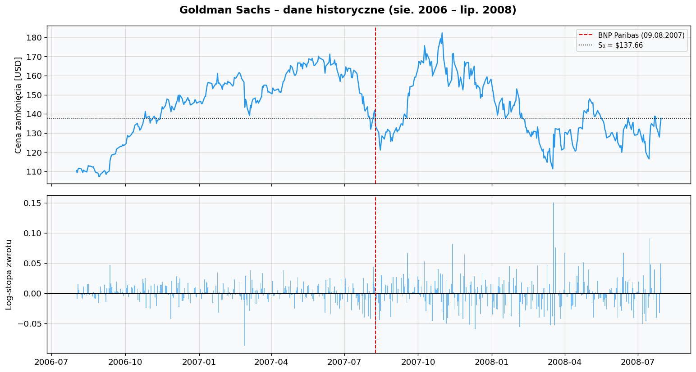
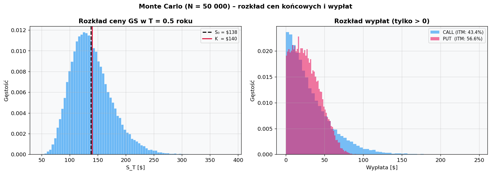
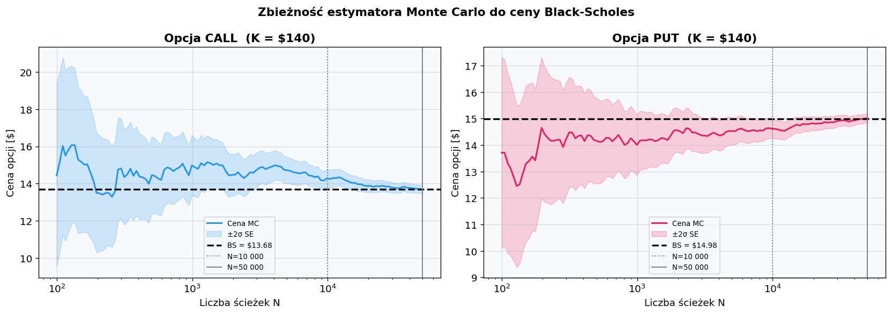

# Raport: Wycena opcji europejskich – Black-Scholes vs Monte Carlo

**Autor:** Oleksandra Krykun  
**Data:** 28 kwietnia 2026  
**Kurs:** Market Risk Lab – Zadanie Domowe 3

---

## Cel

Wycena dwóch europejskich opcji (call i put) na akcje Goldman Sachs (GS) przy użyciu wzoru Blacka-Scholesa oraz metody Monte Carlo (10 000 i 50 000 ścieżek), a następnie porównanie wyników obu metod oraz obliczenie greckich współczynników wrażliwości.

---

## 1. Dane i parametry

**Źródło danych:** Yahoo Finance (`yfinance`), dzienne ceny zamknięcia skorygowane o dywidendy i splity (`Adj Close`).  
**Okres:** 1 sierpnia 2006 – 30 lipca 2008 (503 dni sesyjne) – ten sam co w Zadaniach 1 i 2.  
**Akcja bazowa:** Goldman Sachs (GS).

Wszystkie parametry wyceny wyznaczono bezpośrednio z danych historycznych:

- **S₀** – ostatnia cena zamknięcia GS w oknie (30.07.2008): **$137,66**
- **σ** – historyczna zmienność roczna z log-stóp zwrotu całego okresu: **36,82%**
- **K** – strike ~ATM, zaokrąglony do $5: **$140,00** (dla call i put)
- **T** – termin wygaśnięcia: **0,5 roku (6 miesięcy)**
- **r** – stopa wolna od ryzyka: **1,50%** (rentowność 6M US T-Bill, połowa 2008 r. — środowisko agresywnych obniżek stóp Fed po kryzysie Bear Stearns)

| Parametr | Symbol | Wartość |
|----------|--------|---------|
| Cena aktywa bazowego | S₀ | $137,66 |
| Strike (call i put) | K | $140,00 |
| Czas do wygaśnięcia | T | 0,5 roku |
| Stopa wolna od ryzyka | r | 1,50% |
| Zmienność historyczna | σ | 36,82% |

Obie opcje są nieznacznie **out-of-the-money** (OTM): cena spot ($137,66) jest poniżej strike'u ($140,00), co oznacza, że call jest OTM, a put jest ITM — co dobrze odzwierciedla kontekst rynkowy połowy 2008 r., gdy akcje GS znajdowały się pod presją, tracąc od szczytu (~$250 w końcu 2007 r.) ponad 40%.

> **Uwaga metodologiczna:** jako σ użyto zmienności historycznej wyznaczonej z danych za okres sierpień 2006 – lipiec 2008. W praktyce wycena BS opiera się na zmienności implikowanej (implied volatility), którą rynek wycenia forward-looking. W środowisku kryzysowym obie miary mogą się od siebie istotnie różnić — historyczna σ może zarówno przeszacowywać, jak i niedoszacowywać oczekiwań rynku. Wybór historycznej σ podyktowany jest dostępnością danych i spójnością z poprzednimi zadaniami.

Wykres potwierdza gwałtowny wzrost zmienności po sierpniu 2007 (sygnał BNP Paribas) — skupianie dużych wahań dziennych jest wyraźnie widoczne od Q4 2007. Historyczna zmienność 36,82% jest prawie dwukrotnie wyższa od typowych poziomów sprzed kryzysu (~20%), co bezpośrednio przekłada się na wysokie premie opcyjne.

---

## 2. Wycena Black-Scholes

Wzór analityczny dla europejskiej opcji call i put w modelu Blacka-Scholesa:

$$d_1 = \frac{\ln(S_0/K)+(r+\sigma^2/2)\,T}{\sigma\sqrt{T}}, \qquad d_2 = d_1 - \sigma\sqrt{T}$$

$$C = S_0\,N(d_1) - K\,e^{-rT}\,N(d_2), \qquad P = K\,e^{-rT}\,N(-d_2) - S_0\,N(-d_1)$$

### Wartości pośrednie

| Wielkość | Wartość |
|----------|---------|
| $d_1$ | $+0{,}094144$ |
| $d_2$ | $-0{,}166202$ |
| $N(d_1)$ | $0{,}537503$ |
| $N(d_2)$ | $0{,}433999$ |
| $N(-d_1)$ | $0{,}462497$ |
| $N(-d_2)$ | $0{,}566001$ |

Wartość $d_1 \approx 0{,}094$ wskazuje, że opcja call jest blisko pieniądza — $N(d_1) \approx 0{,}54$, czyli delta call wynosi ok. 54%, co odpowiada sytuacji lekko OTM przy wysokiej zmienności. Wartość $d_2 \approx -0{,}166$ jest ujemna, co oznacza, że ryzykowo-neutralne prawdopodobieństwo wygaśnięcia call w pieniądzu ($N(d_2) \approx 43\%$) jest poniżej 50%.

### Wyniki

| Typ opcji | Cena Black-Scholes |
|-----------|--------------------|
| **CALL** | **$13,6850** |
| **PUT** | **$14,9823** |

Wyższa cena put niż call jest zgodna z parytetem put-call: opcja put jest głębiej ITM ($S_0 < K$). Weryfikacja parytetu put-call:

$$C - P = S_0 - K \cdot e^{-rT} \implies 13{,}6850 - 14{,}9823 = 137{,}66 - 140 \cdot e^{-0{,}015 \cdot 0{,}5}$$

Błąd numeryczny: $0{,}00$ ✓ — parytet spełniony dokładnie.

---

## 3. Wycena Monte Carlo

Symulujemy $N$ realizacji końcowej ceny aktywa według geometrycznego ruchu Browna (GBM):

$$S_T = S_0 \cdot \exp\!\left[\left(r - \frac{\sigma^2}{2}\right)T + \sigma\sqrt{T}\,Z\right], \quad Z\sim\mathcal{N}(0,1)$$

Zdyskontowana średnia wypłat daje estymator ceny:

$$\hat{C}^{MC} = e^{-rT} \cdot \frac{1}{N}\sum_{i=1}^{N}\max(S_T^{(i)}-K,\,0), \qquad \hat{P}^{MC} = e^{-rT} \cdot \frac{1}{N}\sum_{i=1}^{N}\max(K-S_T^{(i)},\,0)$$

Zastosowano **antitetyczne zmienne losowe** — dla każdego wylosowanego $Z$ uwzględniono równocześnie $-Z$, co redukuje wariancję estymatora bez zwiększania liczby wywołań generatora. Każda symulacja (N=10 000 i N=50 000) korzysta z **niezależnego ziarna losowego** (`seed=42` i `seed=43`), co zapewnia wzajemną niezależność obu estymatorów.

### Wyniki

| Typ | N ścieżek | Cena MC | SE |
|-----|-----------|---------|-----|
| CALL | 10 000 | $13,6056 | ±$0,2398 |
| CALL | 50 000 | $13,7514 | ±$0,1076 |
| PUT | 10 000 | $14,9354 | ±$0,1841 |
| PUT | 50 000 | $15,0214 | ±$0,0828 |

Przy N = 50 000 błąd standardowy spada do ok. $0,11 (call) i $0,08 (put) — w obu przypadkach cena BS mieści się w przedziale ufności 95% MC.

Na wykresie widoczny jest rozkład log-normalny cen końcowych $S_T$ (lewy panel), asymetryczny z wyraźnie grubym prawym ogonem ze względu na wysoką zmienność (σ = 36,82%). Strike K = $140 leży nieznacznie powyżej S₀ = $137,66, dzieląc rozkład na strefę wypłat call (prawo od K, ITM: 43,2%) i put (lewo od K, ITM: 56,8%). Prawy panel pokazuje rozkłady wypłat warunkowych — obydwa mają długi prawy ogon typowy dla opcji europejskich.

---

## 4. Porównanie wyników

| Typ | N ścieżek | BS [$] | MC [$] | SE MC [$] | 95% CI MC [$] | BS ∈ CI? | Różnica [$] | Różnica [%] |
|-----|-----------|--------|--------|-----------|---------------|----------|-------------|-------------|
| CALL | 10 000 | 13,6850 | 13,6056 | ±0,2398 | [13,1355 ; 14,0757] | ✓ | −0,0794 | −0,5800% |
| CALL | 50 000 | 13,6850 | 13,7514 | ±0,1076 | [13,5404 ; 13,9623] | ✓ | +0,0664 | +0,4853% |
| PUT | 10 000 | 14,9823 | 14,9354 | ±0,1841 | [14,5746 ; 15,2963] | ✓ | −0,0468 | −0,3126% |
| PUT | 50 000 | 14,9823 | 15,0214 | ±0,0828 | [14,8591 ; 15,1837] | ✓ | +0,0392 | +0,2614% |

Cena BS mieści się w przedziale ufności 95% MC we wszystkich czterech przypadkach (BS ∈ CI ✓).

Wykres zbieżności ilustruje, jak estymator MC (wraz z przedziałem ±2σ) zbiega do poziomej linii BS wraz ze wzrostem N. Przy N = 100 oscylacje są duże; przy N = 10 000 przedział ±2σ jest już wąski; przy N = 50 000 estymator jest praktycznie stabilny.

---

## 5. Greckie współczynniki (Greeks)

Współczynniki greckie mierzą wrażliwość ceny opcji na zmiany parametrów modelu. Obliczono je analitycznie ze wzorów BS:

| Greek | CALL | PUT | Interpretacja |
|-------|------|-----|---------------|
| **Delta** (Δ) | +0,5375 | −0,4625 | hedge ratio — zmiana ceny opcji na $1 zmiany S₀ |
| **Gamma** (Γ) | +0,0111 | +0,0111 | zmiana Delty na $1 zmiany S₀ (identyczna dla call i put) |
| **Vega** (𝒱) | +0,3866 | +0,3866 | zmiana ceny opcji na 1 pp zmianę σ [$] |
| **Theta** (Θ) | −0,0601 | −0,0518 | dzienny zanik wartości czasowej [$] |

**Interpretacja w kontekście kryzysu 2008:**

- **Delta call ≈ 0,54** oznacza, że opcja jest blisko ATM — hedge portfela 1 opcji call wymaga posiadania ok. 0,54 akcji GS.
- **Vega = $0,39** na 1 pp zmianę σ oznacza, że w środowisku kryzysowym, gdzie implied vol GS potrafiła wzrosnąć o 10 pp w ciągu kilku sesji, premia opcyjna rosła o ~$3,87. Wysoka Vega czyni te opcje szczególnie wrażliwymi na zmiany rynkowego strachu (VIX).
- **Theta call = −$0,06/dzień** — każda kolejna sesja bez ruchu ceny kosztuje posiadacza call ok. 6 centów. Przy T = 0,5 roku i wysokiej zmienności zanik wartości czasowej jest umiarkowany.

---

## 6. Wnioski

### 6.1 Czy wyniki BS i Monte Carlo są podobne?

**Tak — wyniki są bardzo zbliżone.** Różnica między ceną BS a MC wynosi poniżej 0,6% we wszystkich przypadkach, a cena BS mieści się w 95% przedziale ufności MC. Oba modele opierają się na identycznym założeniu (GBM), tyle że Black-Scholes dostarcza rozwiązania analitycznego, natomiast Monte Carlo aproksymuje tę samą wartość numerycznie przez uśrednianie zdyskontowanych wypłat po dużej liczbie scenariuszy.

### 6.2 Jak liczba ścieżek wpływa na dokładność?

Błąd standardowy estymatora MC maleje odwrotnie proporcjonalnie do pierwiastka z liczby ścieżek:

$$\text{SE}(N) \propto \frac{1}{\sqrt{N}}$$

Zwiększenie N z 10 000 do 50 000 (5-krotnie) redukuje SE o czynnik $\sqrt{5} \approx 2{,}24$ — co potwierdzają wyniki: SE dla call spada z $0,2398 do $0,1076 (stosunek: 2,23×), a dla put z $0,1841 do $0,0828 (stosunek: 2,22×). Zbieżność jest wyraźnie widoczna na wykresie w skali logarytmicznej.

### 6.3 Kontekst rynkowy — wpływ kryzysu na wycenę

Wysoka zmienność historyczna GS (σ = 36,82%) jest bezpośrednią konsekwencją kryzysu finansowego analizowanego w Zadaniach 1 i 2. Typowa zmienność blue chipów w normalnych warunkach wynosi 15–20%. Wzrost σ przekłada się liniowo na wzrost Vegi (~$0,39/$pp), dlatego premie rzędu $13–15 przy cenie akcji $138 (~10% ceny akcji) są wysokie w porównaniu do stabilnych rynków.

### 6.4 BS vs Monte Carlo — kiedy która metoda?

| Kryterium | Black-Scholes | Monte Carlo (N = 10 000) | Monte Carlo (N = 50 000) |
|-----------|:---:|:---:|:---:|
| Szybkość obliczenia | natychmiastowa | szybka | wolniejsza |
| Dokładność (w modelu GBM) | dokładna | dobra (SE ~$0,22) | bardzo dobra (SE ~$0,10) |
| Elastyczność modelu | ograniczona | bardzo wysoka | bardzo wysoka |
| Obsługa egzotycznych payoffów | nie | tak | tak |

Black-Scholes jest optymalny dla standardowych opcji europejskich w modelu GBM. Monte Carlo zyskuje przewagę dla opcji egzotycznych (azjatyckich, barierowych, lookback), modeli ze stochastyczną zmiennością (Heston, SABR) oraz gdy wypłata zależy od całej ścieżki cenowej — czyli wszędzie tam, gdzie zamknięte rozwiązanie analityczne nie istnieje.

---

*Źródła danych: Yahoo Finance. Teoria: Market Risk Lab – prezentacja „Derivatives" (kwiecień 2026).*
